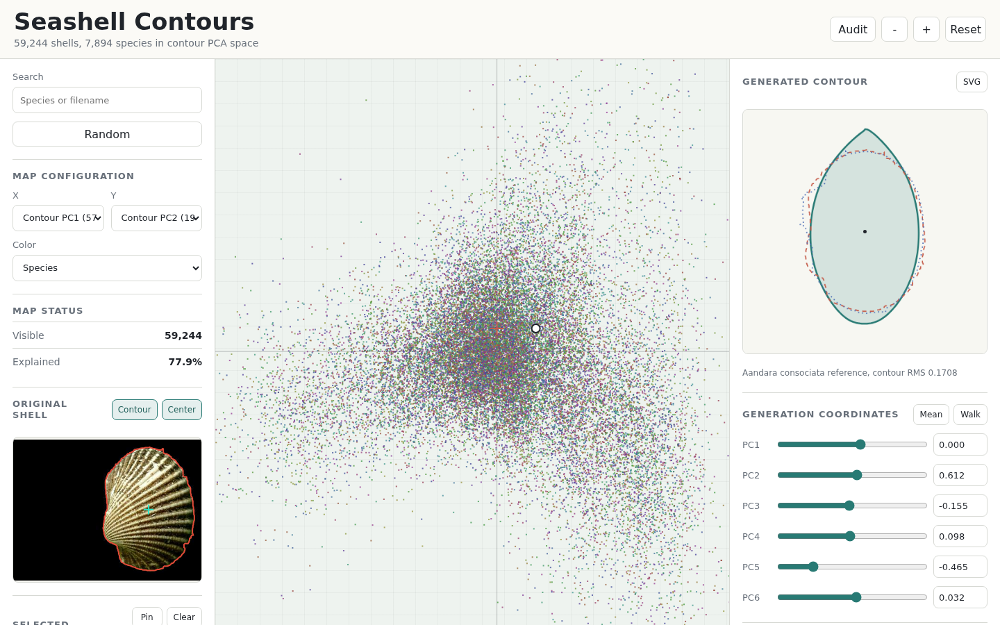

# Seashell Fingerprinting Explorer

Static PCA explorer for browsing seashell contours and generating shell outlines from contour-shape coordinates.

Run `python3 -m http.server 8010`, then open `http://127.0.0.1:8010/`.

