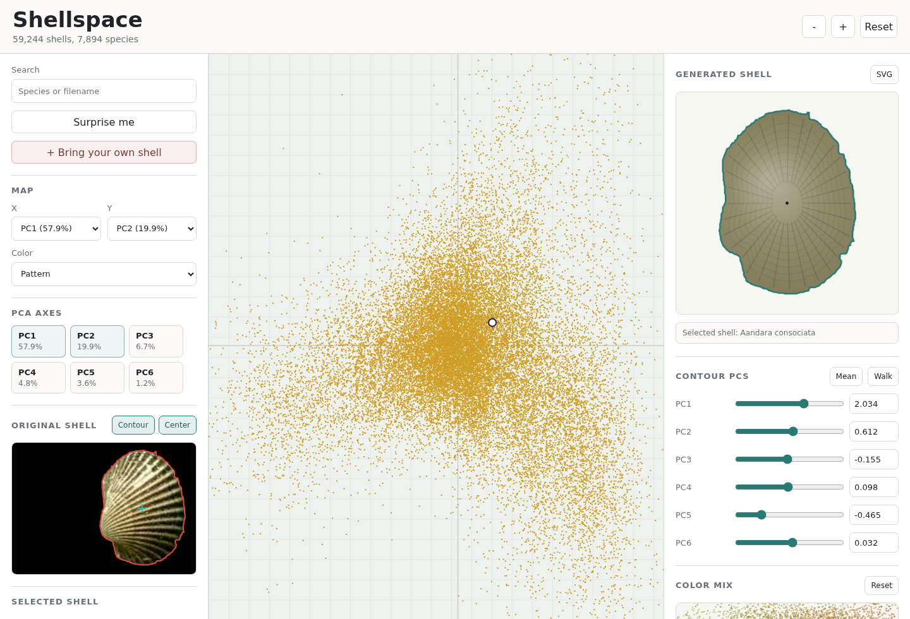

# Shellspace

Static contour, trait, and color PCA explorer for seashell images.

Run `make export-data && python3 -m http.server 8010`, then open `http://127.0.0.1:8010/`.

Dataset: Qi Zhang, Jianhang Zhou, Jing He, Xiaodong Cun, Shaoning Zeng, and Bob Zhang, "A shell dataset, for shell features extraction and recognition", Scientific Data 6, 226 (2019), https://doi.org/10.1038/s41597-019-0230-3. Data: https://doi.org/10.6084/m9.figshare.9939353.

