# I found a seashell in the middle of the desert

To my amazement, I found a fully solid rock that eerily resembles a seashell at the base of a cliff in the Alghat desert, Saudi Arabia. I didn't know what to make of it at first, it had the swirls and shape of a seashell but was fully a rock, more importantly, it *shouldn't* be here; the nearest coastline is Dammam's, 500 km away.

<p align="center">
  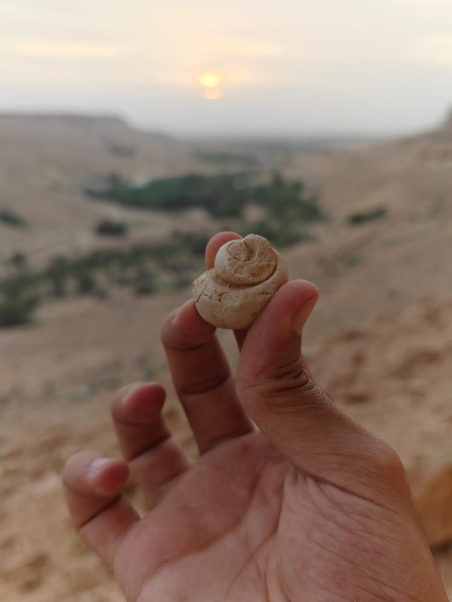 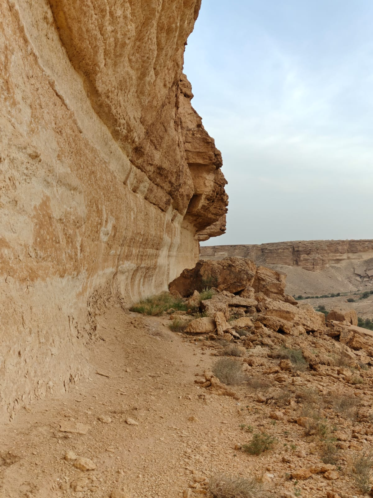
</p>

<p align="center">
  <em>This looks impossible</em>
</p>

Carbonate rocks (e.g. limestone), marine fossils, coral fossils, and sedimentary structures (like ripples or bioturbation) all exist in and around Alghat, which points to the fact that parts of the Arabian Peninsula were once submerged under the sea. Specifically in the late Jurassic age (~150 million years ago)[1].

<p align="center">
  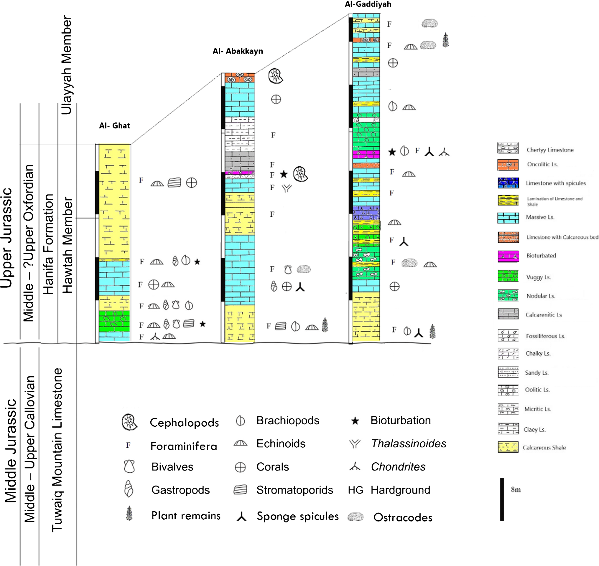
</p>

<p align="center">
  <em>Stratigraphic distribution figure of areas near Najd[1]</em>
</p>

Nevertheless, I was still super curious about the fossil I found; what animal inhabited it? what did it look like back in the Jurassic age? any modern relatives or lookalikes?

The proper way of answering these questions is to conduct a detailed analysis of the fossil (e.g. via inspecting the sediment it was found in, its shape, etc.), this should be done by an expert paleontologist. However, I know no paleontology, or any paleontologist, so I figured I could DIY it myself (how hard could it be..?), though I'll do it strictly via its shape — or what's called its *morphology*. Morphology alone is probably not accurate enough to discern lineage as different species might lookalike but are from different lineages, so this is probably not the best way to do it, but it sounded fun and intuitive, so I gave it a try.

Concretely, I plan on:
1. Mathematically representing the shape of a shell
2. Defining a distance metric between shapes (so that I can find shells similar to the fossil's)
3. Mapping out the *space* of shapes

7894 different species and 59244 images of shells were in the Zhang, et al. shell dataset[2]; good enough for me!

Capturing 'shape' is actually a very hard problem; any object can be rotated by [pitch, yaw, roll](https://simple.wikipedia.org/wiki/Pitch,_yaw,_and_roll), scaled, and translated. Before starting any statistical analysis, I followed a guideline to isolate the shape from other factors
1. The shell must be centered to the midpoint of the picture
2. The scale of the shell must be equivalent across all images (specifically, the maximum distance from the origin is 1)
3. Orientation is the hardest part
    - Pitch and yaw can be fixed by only choosing samples where the shell's opening is facing the camera. This is not perfect, but I found the dataset to be pretty consistent with its angles
    - Roll is difficult. A shell can be rotated in any way around the axis (even whilst the opening is facing the camera). My *fix* was to use the longest radius as the reference point, and rotate the shell so that the longest radius is always on the right. This is not perfect either, but it was good enough for me.

Then, I extracted the contour of the shell to 256 points relative to the center. This way, each shell is represented by a 256x2 matrix, where each row is the (x, y) coordinates of a point on the contour. Example:

```python
> contours[0].shape

(256, 2)

> contours[0].tolist()[:5]

[-0.38561132550239563, 0.9804982542991638],
 [-0.4204626679420471, 0.9785506725311279],
 [-0.4553140103816986, 0.976603090763092],
 [-0.4901654124259949, 0.9746555089950562],
 [-0.5230183005332947, 0.9685550928115845]]
```

<p align="center">
  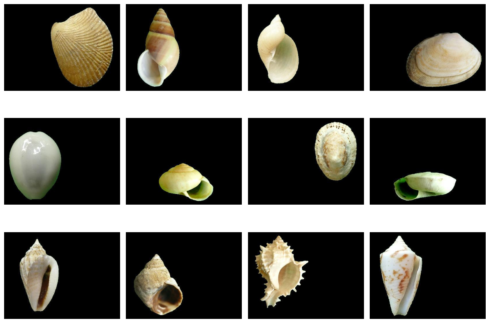 </br>
  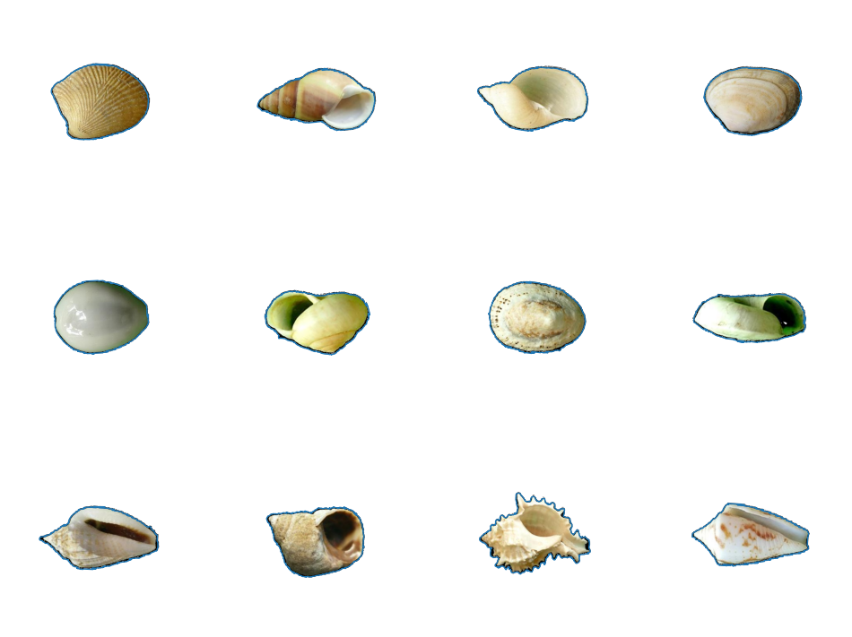
  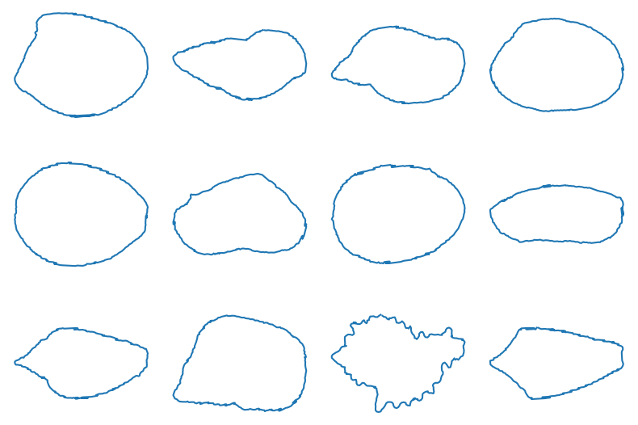
</p>

<p align="center">
  <em>Normalization pipeline</em>
</p>

Naturally, the distance between two shells s1 and s2 is [squared euclidean distance](https://en.wikipedia.org/wiki/Euclidean_distance) between their contour points:

$$
d(s1, s2) = {\sum_{256} (s1.x_i - s2.x_i)^2 + (s1.y_i - s2.y_i)^2}
$$

Representing the space will require 256 dimensions, which is a little more than just the 2 I need to plot it over x and y. Given the normalized shell contour above, it's clear that many of these dimensions are redundant (for instance, the space of all possible 256 contour points allows intersection, while the space of possible shells doesn't, AFAIK), so the space of possible shells can be condensed into a smaller *[latent space](https://en.wikipedia.org/wiki/Latent_space)*. To drive my point home, I'll show three examples of fully random contours (i.e. pseudo-random points around the origin).


<p align="center">
  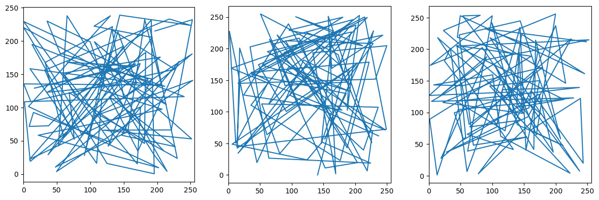
</p>

<p align="center">
  <em>Probably not a real shell</em>
</p>

Dimensionality reduction techniques map the original 256 dimensions onto a smaller number of dimensions (e.g. 2 or 3) while trying to preserve the distance between shells as much as possible. One such technique I'll be using is [Principal Component Analysis (PCA)](https://en.wikipedia.org/wiki/Principal_component_analysis). Here's an excellent fragment that explains how PCA works: https://stats.stackexchange.com/questions/2691/making-sense-of-principal-component-analysis-eigenvectors-eigenvalues/140579#140579.

After applying PCA, I retained 56.50% of the variance using only the first principal component (PC1), and 67.25% using the first two. This means we can describe a shell's shape by only two numbers, and be pretty close to the original shape!

The interesting part is trying to understand what these two numbers mean; dimension 1 in the original 256-dimensional space annotates the location of the first contour point of the shell, whereas dimension 1 of the latent space annotates a high-level feature, learned by the PCA algorithm. We can visually try to understand what PCA dimension PC1 represents by finding two shells, diametrically opposite in the PC1 dimension, yet similar in all other dimensions. 

Essentially, we want to find two shells i and j such that the following score is maximized:

$$
\text{score}(i,j) =
\frac{|z_{i,1} - z_{j,1}|}
{\|\mathbf{z}_{i,2:k} - \mathbf{z}_{j,2:k}\|_2}
$$

PC1 seems to capture the 'pointiness' of the shell, i.e. more than 50% of variance in shell shapes can be explained by how pointy they are. PC2 seems to capture the symmetry of the shell, or perhaps the mass distribution over the vertical axis. I'll leave the interpretation of the other dimensions as an exercise for the reader (I have no idea).


<p align="center">
  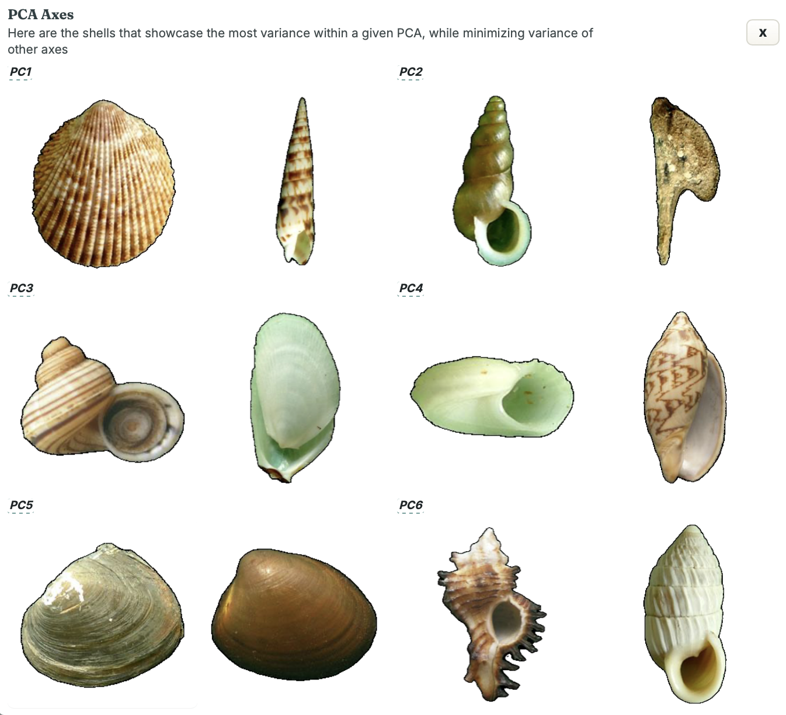
</p>

And now for the grand finale, we can plot the shells in the latent space, and see where our Alghat fossil fits in it. But first, for dramatic tension, I will discuss the plot.

The plot represents PC1 on the x-axis and PC2 on the y-axis, while color represents the roughness of a shell (computed as the difference in slope between consecutive points). The following observations are worth noting:

1.  Negative PC1 values (representing roundness) are way more common than positive PC1 values (representing pointiness). Yet roundness is less diverse and occupies less space than pointy shells
2. Pointy shells seem to be way more rough than round shells
3. Negative PC1 values always have PC2 values close to zero; no shell in the dataset has a round but asymmetric shape. Below, I will project those shells back from latent space to the shape space, imagining *impossible* shells

<p align="center">
  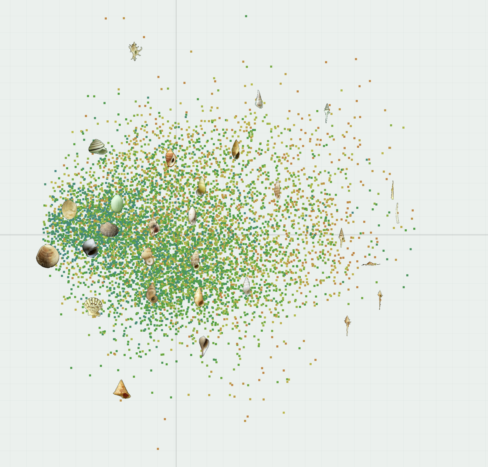
</p>

<p align="center">
  <em>Map of shell latent space with example shells</em>
</p>


<p align="center">
  <a href="./media/PC1.mp4">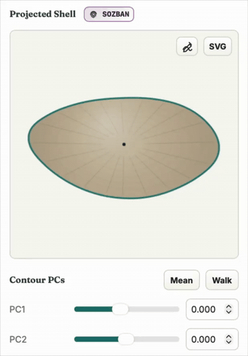</a>
  <a href="./media/PC2.mp4">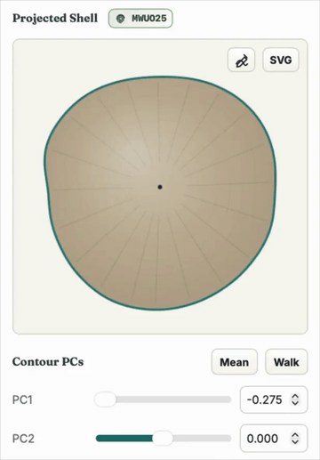</a>
</p>

<p align="center">
  <em>Modifying Principal Components against the mean shell</em>
</p>

<p align="center">
  <a href="./media/impossible_shapes.mp4">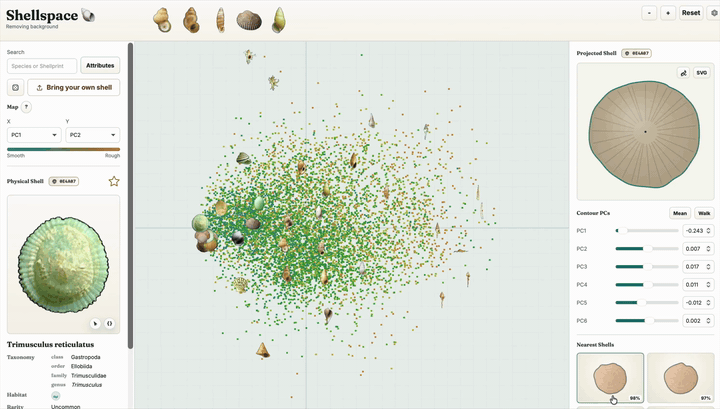</a>
</p>

<p align="center">
  <em>Projecting 'impossible' shells</em>
</p>

So, what shell most closely resembles our Alghat fossil? It's Sphincterochila candidissima (try to pronounce it). However, it is really young, nowhere near the Jurassic age; instead, the earliest fossil of it dates back 38 million years ago[4].  Ultimately, shape is not the best way of determining shell lineage, but its eerie similarity to the Alghat fossil is still fascinating, and perhaps points to some sort of convergent evolution, where two different species evolve to have similar shapes due to similar environmental pressures.

<p align="center" justify="top">
  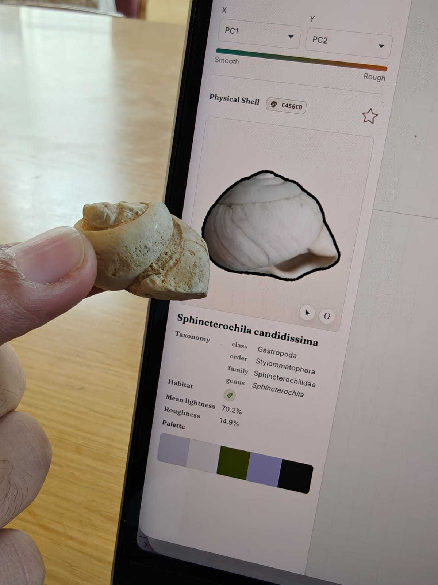 
  
</p>

<p align="center">
  <em>Left: Alghat fossil compared, Right: Sphincterochila candidissima[3]</em>
</p>

## Explore the tool
Feel free to explore the tool and try to figure out where a shell of your choice fits in the shell latent space!

https://shell.hawzen.me

<p align="center">
  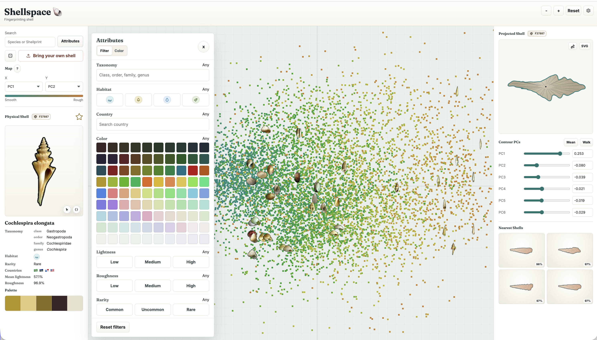
</p>


## Join the discussion

This article has been published to HackerNews, and numerous users have given their insightful opinions and additions. Feel free to read them in: https://news.ycombinator.com/item?id=48318402

## References
1. Aba Alkhayl, S. S. (2022). Marine macro-invertebrate fossils from the Lower Hanifa Formation (Hawtah Member), central Saudi Arabia. Arabian Journal of Geosciences, 15, 1410. https://doi.org/10.1007/s12517-022-10581-w
2. Zhang, Q., Zhou, J., He, J. et al. A shell dataset, for shell features extraction and recognition. Sci Data 6, 226 (2019). https://doi.org/10.1038/s41597-019-0230-3
3. https://en.wikipedia.org/wiki/Sphincterochila_candidissima
4. Tracey, S., Todd, J. A., & Erwin, D. H. (1993). Mollusca: Gastropoda. In M. J. Benton (Ed.), The Fossil Record 2 (pp. 131–167). London: Chapman &
